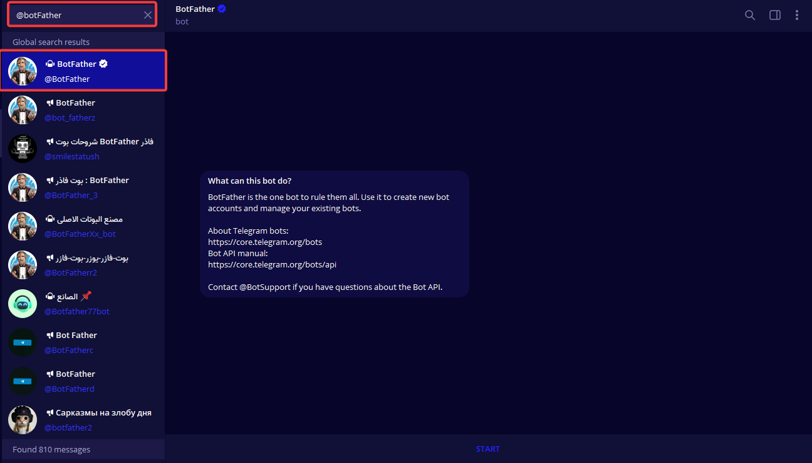
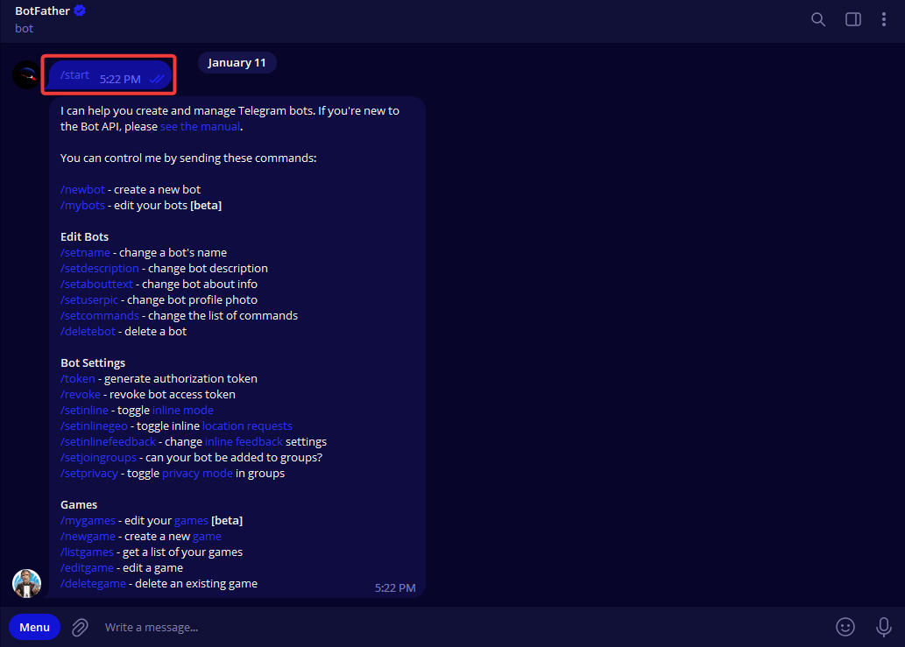
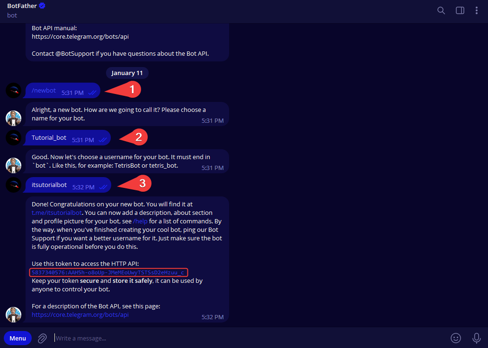

# How to Get Your Bot Token

To set up a new bot, you will need to talk to BotFather. No, he’s not a person – he’s also a bot, and he's the boss of all the Telegram bots.

1. Search for @botfather in Telegram.

    <figure markdown>
    
    <figcaption>BotFather on telegram.</figcaption>
    </figure>

2. Start a conversation with BotFather by clicking on the Start button.

    <figure markdown>
    
    <figcaption>botfather chat.</figcaption>
    </figure>

3. Type `/newbot`, and follow the prompts to set up a new bot. The BotFather will give you a token that you will use to authenticate your bot and grant it access to the Telegram API.

    <figure markdown>
    
    <figcaption>Getting bot token.</figcaption>
    </figure>

!!! warning "Be Careful"
    Make sure you store the token securely. Anyone with your token access can easily manipulate your bot.