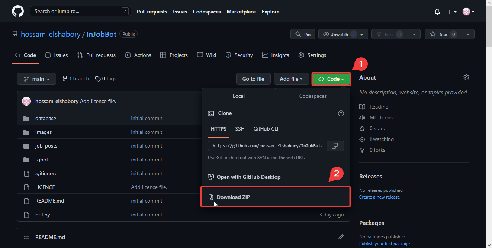

# Downloading | Cloning the repository

## Downloading the repository

Before setting up the bot you will need to download it locally and set it's configurations up.
Head to the [main repository page](https://github.com/hossam-elshabory/InJobBot) and download the repository.

<figure markdown>

<figcaption>Downloading the bot.</figcaption>
</figure>

## Cloning the repository

You can also clone the repository using [git](https://git-scm.com).

!!! info "Cloning command"
    ``` bash 
    git clone https://github.com/hossam-elshabory/InJobBot.git
    ```
