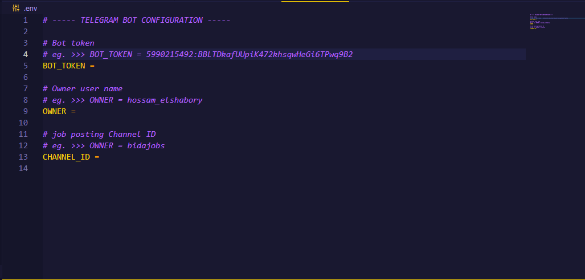

# Configuring Bot Settings

Before you you start the bot or deploy it, you will need to configure it's settings.
To do that you will have to create a `.env` file in the main directory and add the following settings in it.

1. **BOT_TOKEN** : The bot **API_TOKEN** you got from the bot father, if you haven't created one yet, follow this tutorial [Create a bot with BotFather](01_creating_bot_token.md). 

2. **OWNER** : The username of the owner which will be able to control the bot while active.

    !!! note
        To get your telegram username, head to **Settings** > **Edit profile** > **Username**.

3. **CHANNEL_ID** : The channel id the bot will post updated on.

<figure markdown>

<figcaption>.env file.</figcaption>
</figure>
