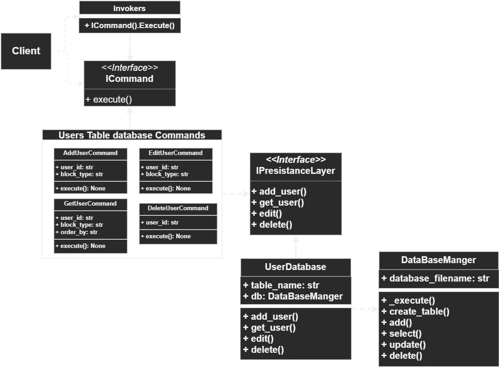

# Bot's Database

## Design Pattern

The interaction with the database is done using a variation of the [command design pattern](https://en.wikipedia.org/wiki/Command_pattern#:~:text=In%20object-oriented%20programming%2C%20the,values%20for%20the%20method%20parameters.), the implementation is inspired and derived from the [Practices Of The Python Pro Book.](https://github.com/daneah/practices-of-the-python-pro).

??? example "Click to view the UML diagram of the implementation"
    <figure markdown>
    
    <figcaption>Database UML diagram.</figcaption>
    </figure>

## Pattern Interfaces

### Commands Interface

The invokers call and execute commands which are concrete classes implementing the `ICommand` *interface* that has an `execute()` method.

??? abstract "Click to View the `ICommand` Interface"
    ::: src.database.db_commands.ICommand

### Persistence Interface

Each command calls a corresponding method in the Persistence class which is a concrete class implementing the `IPersistenceLayer` *interface* controlling the `DatabaseManger` class.

??? abstract "Click to View the `IPersistenceLayer` Interface"
    ::: src.database.persistence.IPersistenceLayer

****

## Pattern Implementation 

### Concrete Commands

After defining the the `ICommand` interface, we can easily create concrete command classes that implement it's functionality, the following is an example of the `AddUserCommand()` command.

??? example "Click to view the `AddUserCommand()` concrete class"
    ::: src.database.db_commands.AddUserCommand

### Concrete Persistence

The `UsersDatabase` concrete class is an implementation of the `IPersistenceLayer` interface which sits between the command classes and the `DatabaseManger` class that executes CURL SQL statements on the database. 

The `UsersDatabase` class is a lower level of abstraction acting on top of the `DatabaseManger` class with a predefined SQL statements designed specifically for the Users and allow groups list tables in the database.

??? abstract "Click to view the `UsersDatabase` class"
    ::: src.database.persistence.UsersDatabase

### The DatabaseManger

The `DatabaseManger` class initializes the connection with the database (sqlite3), and executes SQL statements on the database using CURL commands.

??? abstract "Click to View the `DatabaseManger` class"
    ::: src.database.db_manger.DatabaseManger

